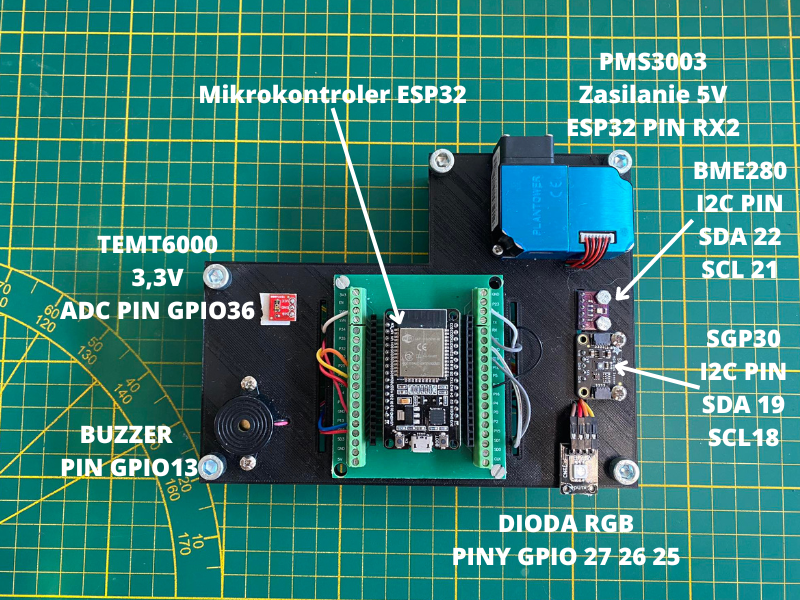
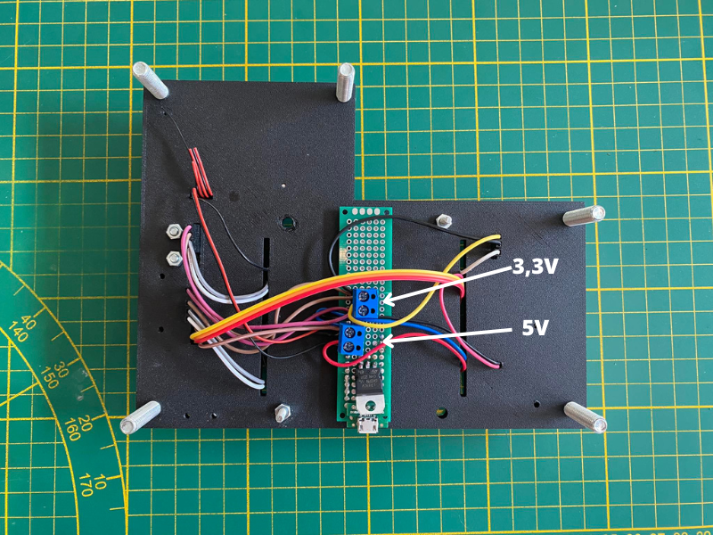

# Makieta służąca do pomiaru parametrów w sali zajęciowej

Wykorzystane czunjniki:

- TEMT6000: analogowy czujnik natężenia światła otoczenia
- SGP30: czujnik koncentracji związków lotnych oraz CO2
- PMS3003: laserowy czujnik pyłu
- BME280: czujnik tempertury, wilgotności i ciśnienia

Na makiecie znajduje się także dioda RGB informująca o stanie serwera oraz przęczyk, którym można sterować poprzez stronę internetową.

Po podłączeniu płytki do zasilania na ESP uruchamia się serwer ze stroną www, z której można odczytać pomiary ze wszystkich czujników.

Insturkcja instalacji poniżej. Eng (and linux) verion below.





## Instrukcja instalacji

Póki co zmiana loginu i hasła do wifi odbywa się w kodzie, więc po zrobieniu tego należy wgrać nowy program na płytkę. Dlatego
póki co każdy, kto chce używać makiety musi mieć środowsiko esp-idf.

### Środowisko

Instalator środowiska esp-idf (wraz z całą instrukcją): <https://docs.espressif.com/projects/esp-idf/en/latest/esp32/get-started/windows-setup.html>.

## Budowanie

Po zainstalowaniu należy pobrać kod z repozytorium (code -> Download ZIP). Następnie w odpowiedniej ścieżce (zapewne będzie to ```C:\Espressif\frameworks\esp-idf-v5.1```) utworzyć folder o nazwie projects (albo innej  - ważne żeby wiedzieć jaki) i wypakować do niego ZIPa pobranego z githuba.

### Zmiana loginu i hasła do wifi

W wybranym edytorze kodu (najprościej będzie w zwykłym notatniku) otworzyć plik sdkconfig i zmienić w nim następujące linie na własne dane sieci wifi:

```console
CONFIG_ESP_WIFI_SSID="name_of_your_network"
CONFIG_ESP_WIFI_PASSWORD="password_to_it"
```

!!! nie usuwać ani nie dodawać nic innego

!!! Po KAŻDEJ ZMIANIE CZEGOKOLWIEK TYM PLIKU NALEŻY ZBUDOWAĆ KOD RAZ JESZCZE

### Kompilacja i wgranie na ESP32

Po ustawieniu wifi w konsoli "ESP-IDF Powershell" przejść do folderu z projektem:

``` console
cd projects
cd httpw12n
```

i wpisać:

```console
idf.py build
```

!!! za pierwszym razem projekt będzie się długo budował.

Gdy projekt się zbuduje (w konsoli pokaże się linijka)

```console
Project build complete. To flash, run this command:...
```

znaczy, że wszystko jest dobrze i można wgrać na płytkę. Wgrywa się poniższą komendą. w miejsce PORT należy wpisać odpowiedni port komputra, zapewne jeden z portów COM, np COM3. W razie problemów sprawdzić w menedżerze urządeń windowsa.

```console
idf.py -p PORT flash
```

### Odczytanie adresu IP

Na koniec należy włączyć monitor portu szeregowego i odczytać IP, pod którym postawiony został serwer. Robi się to komendą:

```console
idf.py monitor
```

Nie powinno sprawić to więszkych problemów, raczej IP będzie dostrzegalne. Zostanie wyświetlone zanim zaczną się inicjować odpowiednie czujniki.

(żeby wyjść z monitora nadusić Ctrl + ])

Teraz można wpisać adres IP w przeglądarkę. Należy upewnić się, że jest się podłączonym do tej samej sieci co ESP. Jeżeli z jakiegoś powodu ESP nie połączy się do wifi, wgrać kod ponownie. Jeżeli problem dalej występuje to zmienić konfigurację routera albo połączyć się do hotspotu udostępnianego z telefonu.


## Setup from scratch

### Set up the esp-idf toolchain

NOTE: The ESP-IDF build system does not support spaces in the paths to either ESP-IDF or to projects.

#### Linux

esp-idf setup src: <https://docs.espressif.com/projects/esp-idf/en/latest/esp32/get-started/linux-macos-setup.html>

First, install all dependencies.

```console
sudo apt-get install git wget flex bison gperf python3 python3-pip python3-venv cmake ninja-build ccache libffi-dev libssl-dev dfu-util libusb-1.0-0 gcc
```

Get ESP-IDF toolchain directly from git

```console
mkdir -p ~/esp
cd ~/esp
git clone --recursive https://github.com/espressif/esp-idf.git
```

Then

```console
cd ~/esp/esp-idf
./install.sh esp32
```

make sure to export the environmental variables.

```console
. ./export.sh
```

#### Windows

follow the installation process from here: <https://docs.espressif.com/projects/esp-idf/en/latest/esp32/get-started/windows-setup.html>

### Build our project

Create projects direcory (in `/esp-idf`)

```console
mkdir projects && cd projects
```

#### Clone the repo

```console
git clone https://github.com/hubertkulak/httpw12n
```

#### Wifi credentials

Before building make sure to set up your wifi credentials in sdkconfig file

```console
CONFIG_ESP_WIFI_SSID="name_of_your_network"
CONFIG_ESP_WIFI_PASSWORD="password_to_it"
```

#### Build the code

Building the code is done with the `idf.py` script. Make sure to be in `/httpw12n` dir

```console
cd projects/httpw12n
idf.py build
````

note: building for the first time may take a while since all of the esp-idf tools  are also building. If fails enter ```idf.py set-target esp32``` and try again.

#### Flashing the device

On linux the port should be `/dev/ttyUSB0` If not, change accordingly.
On windows it will be one of the ```COM``` ports.  

```console
idf.py -p /dev/ttyUSB0 flash
```

note: For some reason (mostly in ubuntu based systems) esp-idf may not be able to detect the connection. If so, try: ``sudo chmod 0777 /dev/ttyUSB0`` and flash again.

#### Read the IP address of the website

The IP address can be read from serial monitor:

```console
idf.py monitor
```

(hint: to exit the monitor hit Ctrl+])

#### Connect to the webstie

Enter the IP address into your web browser. Make sure to be connected to the same wi-fi as the ESP! (If for some reason ESP does not connect, reflash the board)